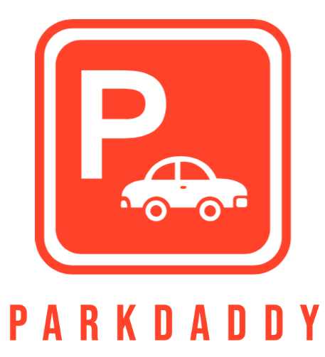

  <a href="https://github.com/RayanMoarkech/ParkDaddy">
  
    <h1 align="center">PardDaddy</h1>
  </a>

---

# Tutorial
- This video will show you a tutorial of the application: [ParkDaddy Tutorial](https://youtu.be/EkQEq-KLKpU)
- We test the app in a real life situation you can see the results in the following video: [ParkDaddy Test](https://www.youtube.com/watch?v=iuWOFolQj28) 

---

# Pre-requisite

- MacOS
  - 
    - Latest v12 Monterey

- XCode
  - 
    - Latest v13.3.1
    - Installation guide [XCode](https://nodejs.org/en/download/)

---

# Running

- Run the code on emulator:
  - 
    - Note that the camera cannot be opened from the emulator
    - Open the project on XCode
    - Select an iPhone emulator device
    - Click Run

- Run the code on an iPhone:
  - 
    - Note that for this, a paid developer account is needed
    - Open the project on XCode
    - Select the iPhone device
    - Click Run